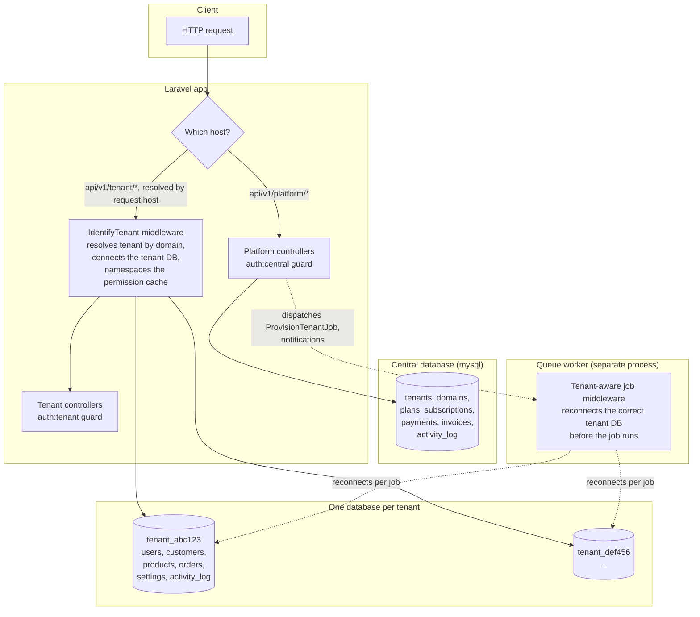

# Multi-Tenant SaaS Backend

A Laravel 13 backend for a multi-tenant SaaS platform: every tenant gets its **own physical MySQL database**, provisioned and torn down automatically, with a central database coordinating billing, domains and platform administration.

This is a portfolio project. It's built to be read, run, and picked apart — not a toy. It covers the parts of multi-tenant SaaS that are easy to get wrong: database-per-tenant isolation, keeping background jobs from leaking data across tenants, permission caching that doesn't bleed between tenants, and payment webhooks that don't trust their own payload.

## Architecture



The one thing to understand about this codebase: **the `tenant` database connection is reconfigured at runtime**, per request, based on which domain the request came in on. `IdentifyTenant` middleware does this for HTTP requests. A queue worker has no request to hang that off of, so a separate job middleware (`TenantAware`) does the same thing for background jobs — this is what makes async tenant provisioning and tenant-scoped background work safe instead of a data-leak waiting to happen.

## What's implemented

**Platform / central**
- Tenant CRUD, suspend/activate, async provisioning (create DB → migrate → seed) via a queued job
- Domain management, with primary-domain switching done inside a transaction
- Plans, subscriptions, trial periods with a scheduled auto-expiry command
- Per-plan user limits, enforced on tenant registration and invites

**Tenant**
- Domain-based tenant resolution, fully isolated database per tenant
- Auth (register/login/verify/reset), team management (invite by email, assign roles, deactivate)
- A small CRM: customers, products, orders — with row-locked stock checks and transactional order totals
- Company settings via a generic key/value store

**Billing**
- Stripe and PayPal, behind a shared `PaymentGatewayInterface`
- Both a polling `verify` endpoint and signed webhooks (`/api/v1/webhooks/{stripe,paypal}`) — the webhook only establishes *which* payment changed; it re-verifies status directly against the gateway rather than trusting the webhook payload, so a replayed-but-signed payload can't forge a completed payment
- Invoices auto-generated on payment completion

**Cross-cutting**
- Roles & permissions (Spatie), scoped per-tenant including the permission cache itself
- Activity log (Spatie) on every major model, both central and tenant-side
- API Resources everywhere, versioned under `/api/v1`
- Notifications (mail + in-app) for provisioning, payments, invites and trial events — tenant-facing ones are deliberately synchronous rather than queued (see [`AppServiceProvider`](app/Providers/AppServiceProvider.php) and the notes on `TrialExpiringSoon`/`TrialExpired`/`UserInvited`, which explain why: Laravel's own notification queue doesn't forward job middleware, so a queued notification to a tenant user would lose its tenant DB connection on a worker)

## Tech stack

PHP 8.3, Laravel 13, MySQL 8, Sanctum (two independent guards: `central` and `tenant`), Spatie Permission + Activitylog, Stripe SDK, Scramble for API docs.

## Quick start (Docker)

```bash
docker compose up -d --build
```

That's it. This brings up four containers:

| Service | What it does |
|---|---|
| `mysql` | Central database, host port `3307` (kept off 3306 in case you already have MySQL running) |
| `app` | Runs migrations + seeders on boot, then serves the API on `http://localhost:8080` |
| `queue` | Processes queued jobs — this is what actually finishes tenant provisioning |
| `scheduler` | Runs `schedule:work`, so the trial-expiry commands fire on their normal cadence |

A seeded platform admin is ready immediately:

```
POST http://localhost:8080/api/v1/platform/login
{"email": "superAdmin@platform.test", "password": "password"}
```

Create a tenant, then add a domain to it (e.g. `acme.test`) and point that host at this server (an entry in `/etc/hosts` for local testing) to reach tenant routes at `http://acme.test:8080/api/v1/tenant/...`.

The compose file ships with a fixed demo `APP_KEY` and a `root`/`root` MySQL user — fine for a local demo, not for anything real. See the comments in [`docker-compose.yml`](docker-compose.yml) for what to change and why (the tenant provisioner needs a privileged DB user to run `CREATE DATABASE`, and all three app containers must share one `APP_KEY` since they decrypt the same encrypted columns).

## Manual setup (without Docker)

Requires PHP 8.3, Composer, and a MySQL server you can create databases on.

```bash
composer install
cp .env.example .env
php artisan key:generate
# edit .env: DB_* to your MySQL instance, DB_USERNAME needs CREATE DATABASE privilege
php artisan migrate --seed
php artisan serve
```

In separate terminals, for the features that need them:

```bash
php artisan queue:work      # tenant provisioning, some notifications
php artisan schedule:work   # trial expiry, tenant migrations
```

## Tests

```bash
# Requires a real MySQL database — tenant provisioning creates and drops
# real databases during tests, which SQLite can't do.
mysql -e "CREATE DATABASE multi_tenant_central_test"
php artisan test
```

53 tests cover tenant isolation, permission scoping, the async provisioning pipeline, webhook signature verification (Stripe's signing scheme is replicated in the test itself; PayPal's is faked via `Http::fake()`), and the CRM/order stock logic. CI (`.github/workflows/tests.yml`) runs the same suite against a MySQL service container on every push.

## API documentation

Auto-generated from routes, FormRequests and API Resources — always in sync with the code, never hand-maintained:

```
http://localhost:8000/docs/api        # interactive docs (php artisan serve)
http://localhost:8080/docs/api        # interactive docs (docker compose)
```

(`docs/api.json` gives the raw OpenAPI 3 spec on either.)

Visible automatically in a local environment; gate it behind a `viewApiDocs` policy for anything else (see `config/scramble.php`).

## Project layout

```
app/
├── Enums/                    Tenant/subscription/payment/order status enums
├── Http/Controllers/
│   ├── Platform/             Central-guard controllers (tenants, billing, admin)
│   └── Tenant/               Tenant-guard controllers (auth, CRM, team mgmt)
├── Jobs/
│   ├── Middleware/TenantAware.php     Reconnects the right tenant DB for a queued job
│   └── Concerns/TenantAwareJob.php    Trait for any job that needs it
├── Models/
│   ├── Tenant.php, Plan.php, ...      Central models
│   └── Tenant/                        Tenant-connection models (User, Customer, Product, Order...)
├── Services/                 One service per aggregate; controllers stay thin
│   ├── Payments/              Gateway abstraction (Stripe, PayPal) + webhook verification
│   └── Tenant/                 Tenant-scoped business logic
└── Notifications/
    ├── Platform/               Queued — only ever touch the central DB
    └── Tenant/                 Synchronous — see the note above on why
```

## A few implementation notes worth reading

- **Tenant credentials are never serialized.** `Tenant.database_password` is `encrypted`-cast at rest and explicitly excluded from every API response via `TenantResource` — a raw `Tenant::with(...)->paginate()` response would otherwise leak the decrypted database password to any caller with `tenants.view`.
- **Validation rules for tenant-scoped uniqueness/existence checks are connection-qualified** (`exists:tenant.products,id`, not `exists:products,id`) — Laravel's `unique`/`exists` rules default to the app's default connection, which is the *central* database, not whichever tenant happens to be active.
- **The Spatie permission cache is namespaced per tenant**, not just the database connection — without this, two tenants' role/permission lookups would share one cache entry.
- **Pagination and API Resources**: a `Resource::collection($paginator)` only gets Laravel's automatic pagination-metadata wrapping when it's the controller's direct return value — wrapping it in `response()->json(['data' => ...])` silently drops `links`/`meta`. Every paginated endpoint in this codebase returns the collection directly for that reason.
